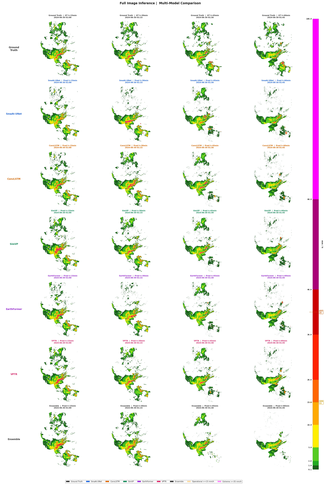
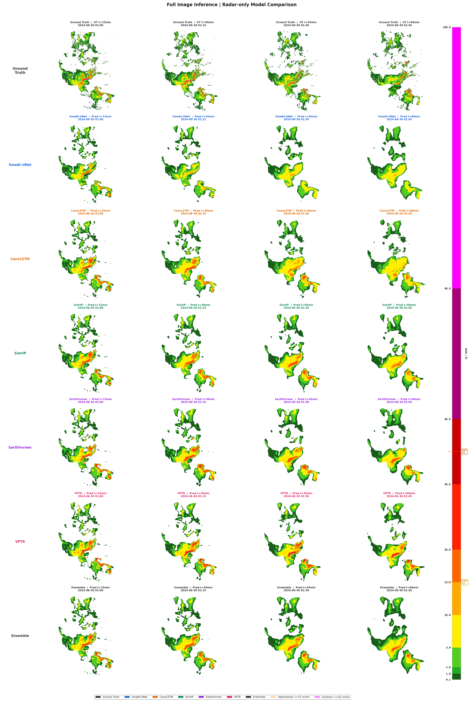
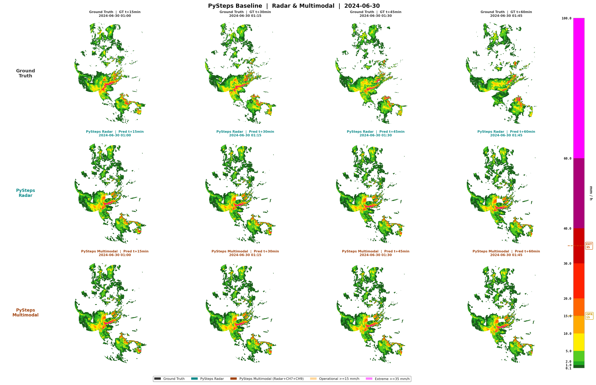

# Convective Precipiation Nowcasting

Convective precipitation is highly localized and evolves continuously over short timescales, making short-term precipitation forecasting particularly challenging despite its importance for early warning and weather-sensitive operations. This thesis evaluates five deep learning architectures for convective precipitation nowcasting over Germany and investigates whether combining radar and satellite observations improves forecasting performance compared with a radar-only configuration. The models were trained using paired RADOLAN radar and SEVIRI satellite observations collected between 2015 and 2024. In addition to the five individual architectures, an ensemble combining their predictions was also evaluated. Forecast performance was assessed at lead times of 15, 30, 45, and 60 minutes using both continuous and categorical evaluation metrics. No single architecture performed best across all metrics. The ensemble achieved the strongest overall performance, whereas VPTR showed the highest categorical skill, particularly at longer lead times. Integrating satellite observations consistently improved forecast quality, with the largest gains observed at longer prediction horizons. Severe convective precipitation remained the most difficult to predict because such events were underrepresented in the training data. These findings demonstrate the importance of both model architecture and multimodal observations for improving convective precipitation nowcasting.


### Example outputs

Storm-sample comparison figures and summary charts saved by inference.py, side by side for each input mode:

#### Multimodal

<table> <tr><td colspan="2"></td></tr> <tr> <td width="50%"></td> <td width="50%"></td> </tr> </table>

#### Radar-only

<table> <tr><td colspan="2"></td></tr> <tr> <td width="50%"></td> <td width="50%"></td> </tr> </table>

#### pySTEPS (non-DL: LK)

<table> <tr><td colspan="2"></td></tr> <tr> <td width="50%"></td> <td width="50%"></td> </tr> </table>


## Contents

- [Overview](#overview)
- [Repository layout](#repository-layout)
- [Requirements](#requirements)
- [Installation](#installation)
  - [Local (pip)](#local-pip)
  - [Docker (recommended)](#docker-recommended)
- [Data preparation](#data-preparation)
- [Configuration](#configuration)
- [Training](#training)
  - [Multimodal (satellite + radar)](#multimodal-satellite--radar)
  - [Radar-only](#radar-only)
  - [pySTEPS baseline](#pysteps-baseline)
- [Inference](#inference)
- [Experiment tracking (MLflow)](#experiment-tracking-mlflow)
- [Models](#models)
- [Outputs](#outputs)
  - [Example outputs](#example-outputs)
- [License](#license)

## Overview

Two input modes are supported end-to-end (data loading, training, and
inference):

| Mode          | Input                                   | Scripts live in    |
|---------------|------------------------------------------|---------------------|
| **Multimodal**| Radar history + Meteosat CH7/CH9 history  | `train/multimodal/` |
| **Radar-only**| Radar history only                        | `train/radar/`      |

Both modes share the same underlying dataset class
(`src/datasets/satellite_radar_patch_dataset.py`), loss functions,
verification metrics (ETS/CSI), and visualization pipeline — only the
input channel count and a `radar_only` flag differ.

Five deep learning backbones are implemented under `src/models/`, each with
a matching training script in both `train/multimodal/` and `train/radar/`:

- **SmaAt-UNet** — `train_smaAt_UNet.py`
- **ConvLSTM** — `train_ConvLSTM.py`
- **SimVP** — `train_simVP.py`
- **EarthFormer** (CuboidTransformer) — `train_earthformer.py`
- **VPTR** — `train_VPTR.py`

A classical optical-flow baseline (**pySTEPS**) is provided in
`train/pySTEPS/train_baseline.py` for non-DL comparison.

## Repository layout

```
convective-nowcasting/
├── config/                       # YAML configs (data paths, model hparams)
│   ├── config.yml
│   └── earthformer_nowcast.yaml
├── metadata/                     # Precomputed sample index, channel stats
├── src/
│   ├── datasets/                 # PyTorch Dataset classes
│   ├── dataloaders/               # DataLoader construction helpers
│   ├── models/                   # Model source (convlstm, simvp,
│   │                              #   earthformer, vptr, smaat_unet, unet, ...)
│   ├── preprocess/                # Metadata / stats generation scripts
│   └── utils/                    # Config loading, transforms, IO, etc.
├── train/
│   ├── multimodal/                # Satellite + radar training scripts
│   ├── radar/                     # Radar-only training scripts
│   └── pySTEPS/                   # Classical baseline
├── visualization/                # Standalone plotting utilities
├── unittest/                     # Sanity checks for the data pipeline
├── slurms/                       # SLURM batch scripts for cluster jobs
├── artifacts/outputs/            # Saved figures / evaluation outputs
├── Dockerfile.multimodal
├── Dockerfile.radar
├── requirements.txt
└── setup.py
```

Model checkpoints, MLflow runs, and training-visualization PNGs are written
at runtime (not checked into the repo) — see [Outputs](#outputs).

## Requirements

- Python 3.10 or 3.11
- A CUDA-capable GPU (EarthFormer and VPTR are the most memory-hungry;
  budget accordingly)
- See `requirements.txt` for the full Python dependency list
  (PyTorch, torchvision, numpy, pandas, matplotlib, scikit-image, scipy,
  einops, omegaconf, tqdm, mlflow, PyYAML)

## Installation

### Local (pip)

```bash
python -m venv .venv
source .venv/bin/activate
pip install -r requirements.txt
pip install -e .          # installs this repo as an editable package (setup.py)
```

### Docker (recommended)

Two images are provided — one per input mode — with no training script
baked in, so you pick which model to run at `docker run` time.

```bash
# Build (from the repo root)
docker build -t nowcast-multimodal -f Dockerfile.multimodal .
docker build -t nowcast-radar      -f Dockerfile.radar .

# Sanity-check GPU visibility inside each image
docker run --rm --gpus all nowcast-multimodal python -c \
    "import torch; print(torch.__version__, torch.cuda.is_available())"

# Run any model (mount the repo so code/checkpoints/data are visible)
docker run --gpus all --shm-size=8g -v $(pwd):/workspace nowcast-multimodal \
    python train/multimodal/train_ConvLSTM.py

docker run --gpus all --shm-size=8g -v $(pwd):/workspace nowcast-radar \
    python train/radar/train_simVP.py
```

For long runs, launch detached and tail the logs:

```bash
docker run -d --gpus all --shm-size=8g --restart unless-stopped \
    -v $(pwd):/workspace --name train-simvp-multimodal \
    nowcast-multimodal python train/multimodal/train_simVP.py

docker logs -f train-simvp-multimodal
```

## Data preparation

Raw inputs are per-timestep `.npy` radar frames (`radar_de/`) and
per-channel satellite frames (`satellite_de_regridded/`). Before training,
run the preprocessing scripts in `src/preprocess/` in order:

| Step | Script | Purpose → Output |
|------|--------|-------------------|
| 1 | `compute_mean_std_satellite.py` | Per-channel satellite normalization stats → `metadata/channel_stats.json` |
| 2 | `generate_metadata_multihorizon.py` / `generate_metadata_multihorizon_season.py` | Builds the sample index (valid `reference_time` → history/target timestamp pairs) across all forecast horizons → `metadata/all_samples.csv` |
| 3 | `generate_metadata_patch.py` | Expands the full-image index into fixed-size training patches with row/col offsets |
| 4 | `sampling_patch_metadata.py` | Subsamples patches (e.g. to balance rain intensity) into the `train`/`val` CSVs referenced by the training configs |
| 5 | `global_quantile_threshold_multihorizon.py` / `compute_presample_thresholds.py` | Computes rain-rate percentile thresholds → `metadata/storm_threshold.json` |
| 6 | `generate_test_data_full_image.py` | Builds the held-out full-image (unpatched) evaluation set used by `inference.py` |


Equivalent SLURM wrappers for a subset of these steps are in `slurms/`.

Before a real training run, verify the pipeline end-to-end with:

```bash
python unittest/sanity_check_dataloader_pipeline.py
```

## Configuration

| File | Contents |
|------|----------|
| `config/config.yml` | Shared settings: data paths, satellite channels, temporal history/cadence, forecast horizons, spatial transform, NaN-handling policy |
| `config/earthformer_nowcast.yaml` | EarthFormer/CuboidTransformer architecture hyperparameters. Its `input_shape` must match `[n_timesteps, 256, 256, n_channels_per_step]` — `n_channels_per_step` is `3` for multimodal (2 satellite channels + radar) and `1` for radar-only. Each EarthFormer training script asserts this at startup |

Per-model training hyperparameters (learning rate, gradient clipping, mixed
precision, loss weights, checkpoint/MLflow names) live at the top of each
`train_*.py` script as a `MultiHorizonTrainingConfig` class — edit there
rather than in `config.yml`.

## Training

Every training script is self-contained: it loads `config.yml`, builds the
dataset/dataloaders, builds its model, and runs the full train/validate
loop with checkpointing, ETS/CSI verification, and MLflow logging.

### Multimodal (satellite + radar)

```bash
python train/multimodal/train_smaAt_UNet.py
python train/multimodal/train_ConvLSTM.py
python train/multimodal/train_simVP.py
python train/multimodal/train_earthformer.py
python train/multimodal/train_VPTR.py
```

### Radar-only

Identical interface, radar history only as input:

```bash
python train/radar/train_smaAt_UNet.py
python train/radar/train_ConvLSTM.py
python train/radar/train_simVP.py
python train/radar/train_earthformer.py
python train/radar/train_VPTR.py
```

### pySTEPS baseline

```bash
python train/pySTEPS/train_baseline.py
```

Each script writes:

- `CHECKPOINTS_<MODEL>_.../last.pth`, `best.pth`, `best_ets.pth`
- `TRAINVIS_<MODEL>_.../` and `VALVIZ_<MODEL>_.../` — periodic
  storm-sample visualization PNGs
- An MLflow run under `mlruns/` with per-epoch loss, MAE/RMSE/SSIM/PSNR,
  and ETS/CSI at the configured operational and extreme thresholds

## Inference

Full-image (unpatched, patch-stitched) multi-model comparison and
ensembling:

```bash
python train/multimodal/inference.py --num_samples 10
python train/radar/inference.py      --num_samples 10
```

Useful flags: `--horizons`, `--metadata_csv`, `--out_dir`, `--patch_size`,
`--patch_overlap`, `--device`, `--show_storm_metrics`. Each run writes
per-sample comparison figures plus `dl_fullimage_metrics.csv` and
`dl_fullimage_mean_metrics.csv` to `--out_dir`.

## Experiment tracking (MLflow)

```bash
mlflow ui --backend-store-uri mlruns
```

Then open `http://localhost:5000` to compare runs across models, input
modes, and hyperparameter settings.

## Models

| Model        | Source                          | Notes                                   |
|--------------|----------------------------------|------------------------------------------|
| SmaAt-UNet   | `src/models/smaat_unet/`        | Depthwise-separable U-Net + CBAM         |
| ConvLSTM     | `src/models/convlstm/`          | Encoder–ConvLSTM–Decoder                 |
| SimVP        | `src/models/simvp/`             | Conv encoder/decoder + Inception temporal blocks |
| EarthFormer  | `src/models/earthformer/`       | Cuboid-attention spatiotemporal transformer |
| VPTR         | `src/models/vptr/`              | Non-autoregressive video transformer     |
| pySTEPS      | `train/pySTEPS/`                 | Classical optical-flow baseline (non-DL) |

`src/models/` also vendors several additional research backbones
(MCVD, MetNet, PredRNN, Rainformer, SwinLSTM, pix2pixHD) that are not yet
wired into a `train/` script — see their subdirectories for standalone
usage.

## Outputs

- `artifacts/outputs/{multimodal,radar,non-DL}/` — saved evaluation
  figures and summary tables
- `logs/` — free-form run logs
- Checkpoints, viz PNGs, and `mlruns/` are created at the repo root by
  each training script (not tracked in version control by default)

## License

See [LICENSE](LICENSE).