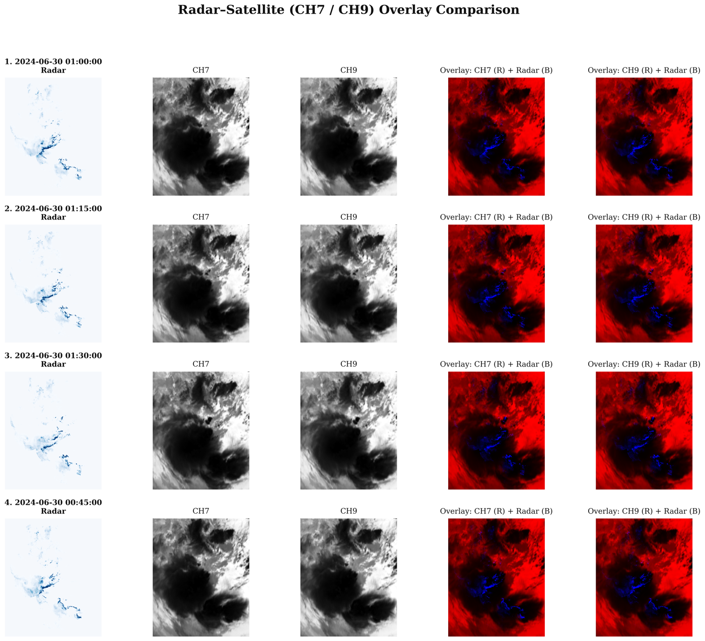

# Preprocessing

## Key scripts (`src/preprocess/`)

| Script | Purpose |
|---|---|
| `compute_mean_std_satellite.py` | Computes per-channel normalization statistics for satellite data. |
| `generate_metadata_patch.py` | Generates patch-level metadata (valid sample windows, NaN filtering) for training. |
| `sampling_patch_metadata.py` | Applies importance sampling, over-representing high-precipitation ("top bucket") patches. |
| `compute_presample_thresholds.py` | Computes the percentile threshold used to define the "top bucket" for sampling. |
| `generate_test_data_full_image.py` | Generates full-image (non-patched) test samples for final evaluation. |
| `generate_metadata_multihorizon_season.py` | Generates metadata with an explicit seasonal (JJAS) filter. |

## Patch configuration

| Parameter | Value |
|---|---|
| Patch size | 256 × 256 |
| Patch stride | 64 |
| NaN rejection threshold | 0.3 (patches with ≥30% NaN coverage are discarded) |

## Importance sampling

To address the natural imbalance between light and heavy precipitation,
patches are sampled with two parameters:

- **`r` (top-bucket ratio)** — the fraction of patches (ranked by the 99th
  percentile rainfall in the sequence) considered "heavy rain": **r = 0.3829**.
- **`p` (keep probability)** — the probability that a top-bucket patch is
  retained; the remaining patches are kept with probability `1 - p`:
  **p = 0.6171**.

## Normalization

| Field | Transform |
|---|---|
| Radar | Log transform, clipped at 128 mm/h |
| Satellite | Z-score normalization (per-channel mean/std) |

### Radar log transform [39]

$$
f(x) = \frac{\log_{10}(\max(x, z) + \epsilon)}{\log_{10}(C_{\max} + \epsilon)}
\qquad (3.1)
$$

where $z$ is the lower (noise-floor) threshold, $\epsilon = 1.0$ is a
structural offset, and $C_{\max} = 128.0$ mm/h is the upper clipping bound.
The inverse transform, applied at inference to recover physical units, is:

$$
f^{-1}(y) = \operatorname{clamp}\!\left(10^{\,y \cdot \log_{10}(C_{\max}+\epsilon)} - \epsilon,\; 0,\; C_{\max}\right)
\qquad (3.2)
$$

### Satellite Z-score normalization [40]

$$
\hat{x} = \frac{x - \mu}{\sigma + \alpha} \qquad (3.3)
$$

where $\mu$, $\sigma$ are the per-channel mean and standard deviation
(computed on the training set only), and $\alpha = 1\times10^{-8}$ prevents
division by zero.

## Patch extraction

For a full image of size 1100 × 900 with a 256 × 256 patch and stride 64,
the number of patches per image is:

$$
N_{\text{patches}} = \left(\left\lfloor\frac{1100-256}{64}\right\rfloor+1\right)
\times \left(\left\lfloor\frac{900-256}{64}\right\rfloor+1\right)
= 14 \times 11 = 154 \qquad (3.4)
$$

256 × 256 was chosen over smaller patches (e.g. 128 × 128) because convective
storms often exceed 128 × 128 pixels at 1 km resolution, and a larger patch
captures both the precipitation core and surrounding context needed for
accurate nowcasts.

## Regridding satellite onto the radar grid

Radar (1100 × 900) and satellite (175 × 320) observations live on different
native grids, so pixel `(i, j)` does not represent the same geographic
location in both. Naively resizing would misalign the two sources.

**Downsampling** a higher-resolution grid to a coarser one averages
neighbouring pixels, which blurs convective-cell boundaries and removes
small-scale spatial structure. **Upsampling** a lower-resolution grid to a
finer one cannot recover detail that was never recorded [41] — it only
interpolates new pixel values from surrounding measurements, giving the
appearance of extra detail that is not actually present in the data.

Instead, satellite pixel positions are converted to geographic coordinates,
transformed into the radar coordinate system, and resampled onto the fixed
radar grid via **bilinear interpolation** [42], falling back to nearest-neighbour
where bilinear interpolation cannot be computed (e.g. near missing values):

$$
\hat{v}(x,y) = (1-t_x)(1-t_y)\,v_{00} + t_x(1-t_y)\,v_{10} + (1-t_x)t_y\,v_{01} + t_x t_y\,v_{11}
$$

where $v_{00}, v_{10}, v_{01}, v_{11}$ are the satellite values at the four
grid points surrounding the target radar-grid location, and $t_x, t_y \in
[0,1]$ are the fractional distances from $(x,y)$ to the lower-left
surrounding point along each axis. This produces satellite images with the
same 1100 × 900 dimensions and grid as the radar data, enabling direct
pixel-by-pixel channel concatenation.

*Regridded radar and CH7/CH9 satellite observations for a convective event
(30 June 2024). Overlay columns show satellite (red) and radar (blue)
superimposed on the common grid — the close spatial correspondence between
precipitation regions and adjacent cold cloud structures confirms correct
alignment.*

## Two-bucket quantile sampling

A quantile threshold $\tau$ is computed from the distribution of per-patch
99th-percentile rainfall values:

$$
\tau = Q_{1-r}\!\left(\{p_{99}(x_i)\}_{i=1}^{N}\right) \qquad (3.5)
$$

Patches are assigned to an upper ("heavy rain") or lower bucket:

$$
B^{+} = \{i : p_{99}(x_i) \ge \tau \text{ and } p_{99}(x_i) > 0\} \qquad (3.6)
$$

$$
B^{-} = \{i : p_{99}(x_i) < \tau \text{ or } p_{99}(x_i) = 0\} \qquad (3.7)
$$

Each patch is then kept or discarded with $u_i \sim \mathcal{U}(0,1)$:

$$
\text{keep}(i) =
\begin{cases}
u_i < p & \text{if } i \in B^{+} \\
u_i < 1-p & \text{if } i \in B^{-}
\end{cases}
\qquad (3.8)
$$

**Selected values:** $r = 0.3829$, $p = 0.6171$ — chosen from the empirical
proportion of training patches containing measurable precipitation. Since
$p = 1-r$, this gives a 1:1 balance between the heavy and dry buckets.
Completely dry patches always fall in $B^{-}$. No synthetic data are
generated and the radar/satellite data itself is never modified — sampling
only affects which metadata rows are used by the data loader.

!!! note
    Config values above should always be cross-checked against the current
    [`config/config.yml`](config.md), which is the single source of truth
    used by all training scripts.
