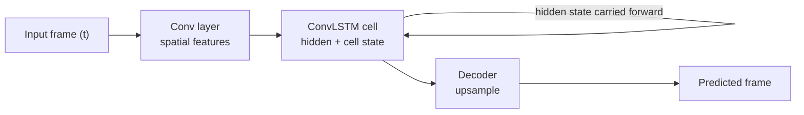

# ConvLSTM

ConvLSTM [16] combines the convolution operation with the LSTM [17]
structure. The model receives a sequence of precipitation observations and processes the
frames one time step at a time. At each step, convolution is used to
extract spatial features, while the hidden and cell states carry
information from the previous time steps. The input, hidden state, and
cell state are updated through the LSTM gates, allowing the model to decide
which information should be retained or updated. The updated hidden state
is then used when processing the next frame. For precipitation nowcasting,
this allows the model to use the recent movement and development of
precipitation patterns when predicting future frames.

## Simplified flow

## Key files (`src/models/convlstm/`)

| File | Role |
|---|---|
| `model.py` | Generic Encoder-Decoder (`ED`) wrapper. |
| `encoder.py` / `decoder.py` | Stage-wise encoder/decoder implementations. |
| `ConvRNN.py` | The ConvLSTM cell implementation. |
| `net_params.py` / `net_params_multihorizon.py` / `net_params_radar.py` | Per-configuration layer parameters. |
