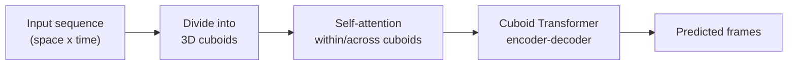

# Earthformer

Earthformer uses a Transformer-based structure to process spatiotemporal
data. The input sequence is divided into smaller 3D cuboids that contain
information from both the spatial dimensions and the time dimension. The
model applies self-attention to these cuboids so that information from
different locations and time steps can be related to each other. The
resulting features are passed through the Transformer layers to build a
representation of the spatiotemporal patterns in the input sequence. The
model then uses this representation to predict the future frames. For
precipitation nowcasting, this approach is useful because the development
of a convective cell at one location can be related to changes occurring in
other locations and at earlier time steps.

## Simplified flow

## Key files (`src/models/earthformer/`)

| File | Role |
|---|---|
| `cuboid_transformer/cuboid_transformer.py` | `CuboidTransformerModel`, the main architecture. |
| `cuboid_transformer/cuboid_transformer_patterns.py` | Registry of attention patterns (axial, cross-K×K, etc.). |
| `config.py` | Path configuration (not architecture hyperparameters). |
