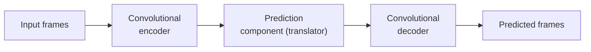

# SimVP

SimVP [54] uses a convolutional encoder and decoder to predict future frames
from a sequence of observed frames. The encoder first converts the input
frames into feature representations, which contain information about the
observed precipitation patterns. These features are then processed by the
prediction component to learn the changes between the observed and future
states. Finally, the decoder converts the learned features back into the
spatial form of the predicted precipitation fields. SimVP does not use
recurrent connections or attention mechanisms, so the model provides a
simpler way of learning the relationship between past and future
precipitation fields. This makes it useful in this study as a
convolution-based model for comparison with the recurrent and
Transformer-based architectures.

## Simplified flow

## Key files (`src/models/simvp/`)

| File | Role |
|---|---|
| `model.py` | `Encoder`, `Decoder`, `Mid_Xnet`, and the top-level `SimVP` module. |
| `modules.py` | `ConvSC` and `Inception` building blocks. |

!!! note
    The "Inception" module is a small, custom, from-scratch block using
    multiple parallel kernel sizes — not a pretrained ImageNet Inception
    network.
