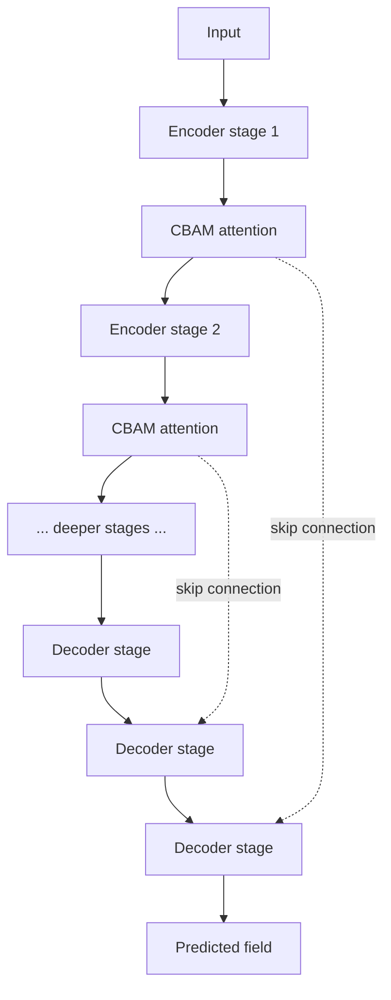

# SmaAt-UNet

SmaAt-UNet [5] follows an encoder-decoder structure similar to U-Net [18].
The input
precipitation fields first pass through the encoder, where their spatial
dimensions are reduced while higher-level features are extracted. The
decoder then gradually increases the spatial resolution to reconstruct the
predicted precipitation field. Information from the encoder is passed to
the decoder through skip connections, helping to retain details that may be
lost during downsampling. SmaAt-UNet uses depthwise separable convolutions
to reduce the number of parameters and attention gates in the skip
connections to give more weight to important regions. This is useful for
the present task because convective cells can occupy only a small part of
the radar field and their spatial details are important for accurate
prediction.

## Simplified flow

## Key files (`src/models/smaat_unet/`)

| File | Role |
|---|---|
| `SmaAt_UNet.py` | Top-level model definition. |
| `unet_parts_depthwise_separable.py` | `DoubleConvDS`, `DownDS`, `UpDS`, `OutConv`. |
| `layers.py` | CBAM attention module. |
