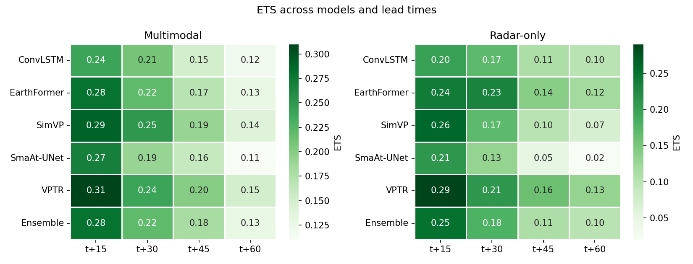
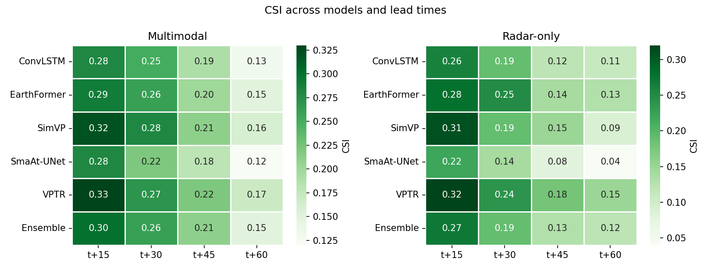
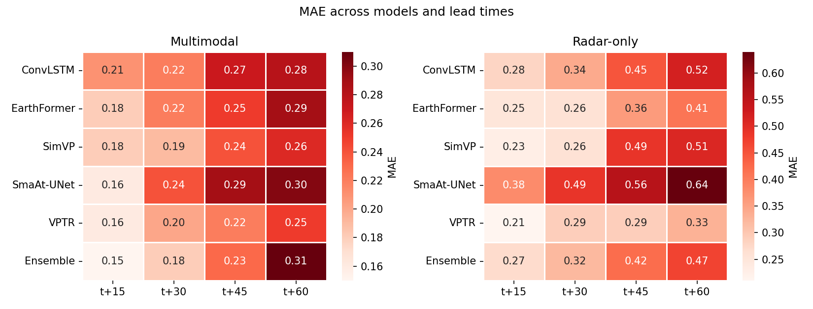
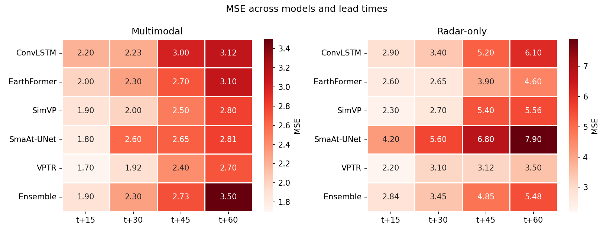
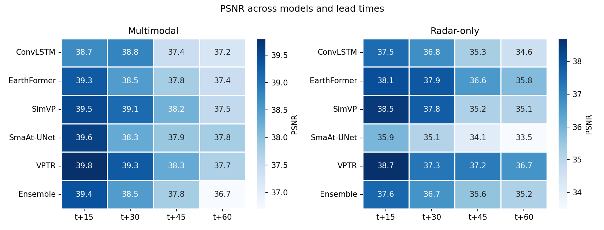
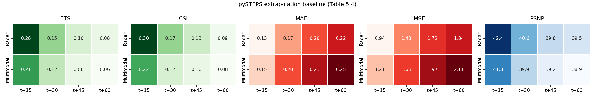

# Results & Findings

## Two input configurations

$$
\mathcal{X}_{\text{multi}} = [\,X_{\text{radar}},\, X_{\text{CH7}},\, X_{\text{CH9}}\,] \in \mathbb{R}^{B\times T\times 3\times H\times W}
\qquad (5.1)
$$

$$
\mathcal{X}_{\text{radar-only}} = [\,X_{\text{radar}}\,] \in \mathbb{R}^{B\times T\times 1\times H\times W}
\qquad (5.2)
$$

where $B$ is batch size and $T=4$ input timesteps. The two configurations
differ only in channel composition, enabling a direct, controlled comparison.

## pySTEPS baseline configuration (Table 5.3)

Extrapolation settings were selected via grid search on a held-out
validation subset (scored by pooled CSI/ETS at 5 and 15 mm/h, averaged over
the 15 and 30 minute lead times), then applied unchanged to the test set:

| Parameter | Search space | Selected |
|---|---|---|
| Motion estimation method | LK, VET | LK |
| Nowcast method | Extrapolation, S-PROG | Extrapolation |
| Extrapolation interpolation | Nearest, Bilinear | Bilinear |
| History frames | 3, 5 | 5 |
| Persistence blending | On, Off | Off |

## Dataset scale

| | Radar (RADOLAN) | Satellite (SEVIRI CH7 + CH9) |
|---|---|---|
| Period | 2015–2024 (3,653 days) | 2015–2024 (3,653 days) |
| Cadence | 5 minutes | 5 minutes |
| Images per day | 288 | 288 per channel |
| Native resolution | 1100 × 900 | 175 × 320 (regridded to radar grid) |

## Performance across models and lead times

## pySTEPS extrapolation baseline

## Headline results

- **No single architecture wins on every metric.** VPTR achieved the
  strongest categorical performance (ETS, CSI) across most lead times; the
  ensemble was competitive at shorter horizons but its ranking declined as
  lead time increased.
- **Satellite fusion helps deep learning models, not the classical
  baseline.** The multimodal configuration generally outperformed
  radar-only across the five architectures, but the pySTEPS extrapolation
  baseline did *not* benefit from adding satellite input — its accuracy
  declined instead.
- **Deep learning vs. extrapolation is a trade-off, not a clean win.**
  pySTEPS [12] radar-only achieved lower MAE/MSE and higher PSNR than every deep
  learning model at every lead time, while the deep learning models achieved
  modestly higher CSI/ETS — consistent with the "double penalty problem" [64] in
  nowcasting verification (smooth extrapolation forecasts minimize
  pixel-wise error but under-detect sharp, localized events).
- **Intense convective precipitation remains the hardest case** for every
  architecture, primarily because high-intensity events are underrepresented
  in the training data.

## Hypothesis discussion

**H1 — architecture affects performance.**
The relative ranking of architectures was not fixed; it shifted with input
configuration and metric. At t+60, SimVP's ETS fell about 50% moving from
multimodal to radar-only input, while ConvLSTM's fell only about 17% —
architecture choice mattered most precisely where less input information
was available.

**H2 — multimodal input improves forecasts.**
Across the deep learning models, multimodal input generally outperformed
radar-only, with the gap widening at longer lead times (e.g. the ensemble's
MSE advantage grew from 1.90 vs. 2.84 at t+15 to 3.50 vs. 5.48 at t+60).
This benefit did **not** extend to the pySTEPS baseline, whose PSNR declined
after satellite input was added — the benefit of satellite fusion is
architecture-dependent.

**H3 — ensembling improves performance.**
The ensemble held its own on skill scores but the advantage faded on
error-based metrics as lead time increased: at t+60 (multimodal), its MSE
was about 30% higher and MAE about 24% higher than VPTR, the best individual
model. Simple averaging did not consistently retain the strongest
individual model's performance — targeted combination strategies (weighted
averaging, stacking) are suggested as future work.

## Limitations

- Only 2 of SEVIRI's 12 spectral channels (CH7, CH9) were used.
- No additional meteorological variables (temperature, humidity, wind,
  lightning) were incorporated.
- Evaluation is limited to the 2024 test period and June–September (JJAS)
  months only.
- Only one loss formulation (the hybrid weighted MAE) was evaluated; no
  statistical significance testing was performed on the reported metric
  differences.
- Training was capped at 50 epochs with early stopping; generative [20],
  diffusion-based [22], and transfer-learning [66] approaches were out of scope.

## Future work

- Add further SEVIRI channels, lightning data [65], and NWP fields as inputs.
- Explore feature-level / intermediate fusion instead of input-level
  concatenation.
- Improve representation of intense convective events via targeted sampling
  or additional seasons/regions.
- Investigate weighted or learned ensemble strategies (potentially varying
  by lead time) instead of simple averaging.
- Apply explainability (XAI) techniques (saliency maps, attention
  visualization) to understand how satellite channels contribute to
  predictions.
- Evaluate across multiple years and geographic regions to assess
  generalization.
